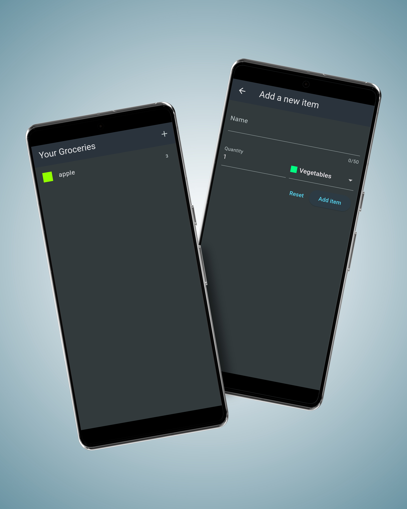

# Shopping List App

A Flutter-based shopping list application that allows users to add, view, and manage their grocery items with Firebase integration for real-time data storage and synchronization.

## My Screens:
  

## Features

- **Add Items**: Users can add new grocery items by specifying the name, quantity, and type.
- **View Items**: The main page displays a list of all grocery items added by the user.
- **Real-time Updates**: Integrated with Firebase for real-time data storage and updates.